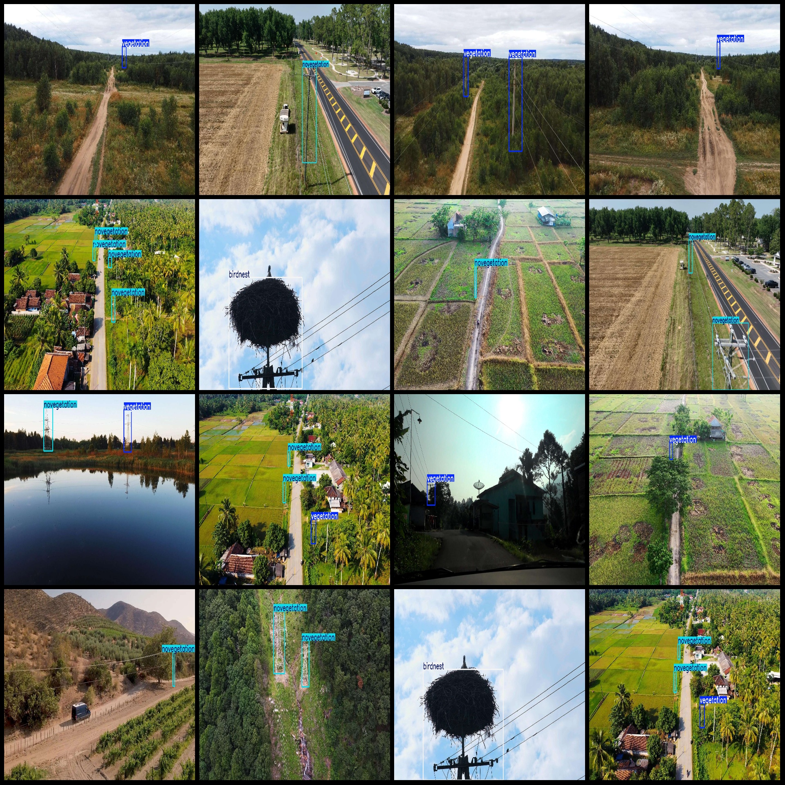
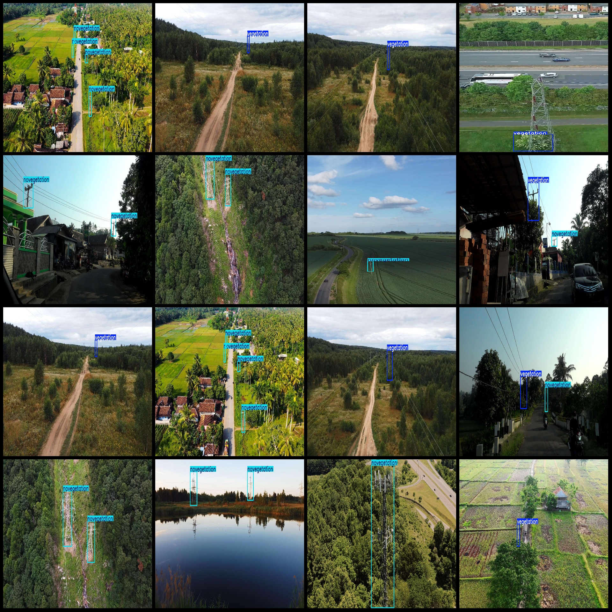

# Drone Viewpoint Power Scene Transmission Line Tower Vegetation Invasion Bird Nest Detection Dataset VOC+YOLO Format with 2881 Images, 3 Categories

Dataset Format: Pascal VOC format + YOLO format (txt files without segmentation paths, only containing jpg images and corresponding VOC format xml files and YOLO format txt files).
Image Count (number of jpg files): 2881
Annotation Count (number of xml files): 2881
Annotation Count (number of txt files): 2881
Number of Annotation Categories: 3
Annotation Category Names (note that the YOLO format category order does not correspond to this, but refer to the "labels" folder's "classes.txt" for reference): ["birdnest", "novegetation", "vegetation"]
Each category's number of bounding boxes:
- Bird Nest (Bird's Nest) Bounding Boxes = 142
- No vegetation (No vegetation coverage) Bounding Boxes = 2801
- Vegetation (Vegetation Cover) Bounding Boxes = 1687
Total Bounding Boxes: 4630
Image Resolutions: Multiple resolutions, such as 1920x1080, 1920x1413, etc.
Drone: DJI MAVIC 3
Collecting Height: 50m
Collecting Angle: 60°
Using Annotation Tool: labelImg
Annotation Rules: Draw a rectangle around the category
Important Notices: None
Special Statement: This dataset does not guarantee the accuracy of the trained model or weight files.
Image Preview:
## Picture

Here is a pay link on Stripe ( https://buy.stripe.com/3cs8yP7sY87d0vu9AB ). Please contact me lonlonago@foxmail.com after funding $89, and I will send you a complete data files , thank you!

